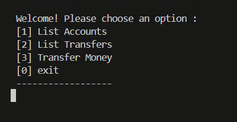
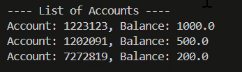
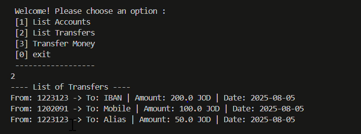
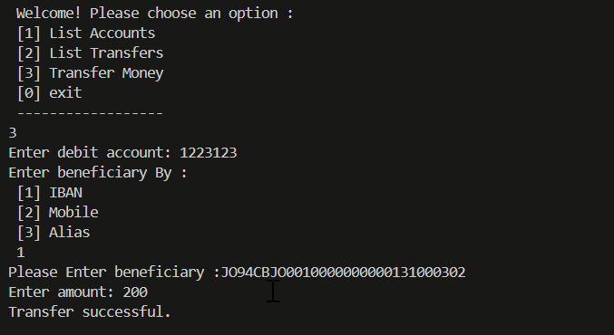
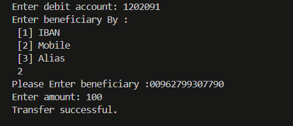
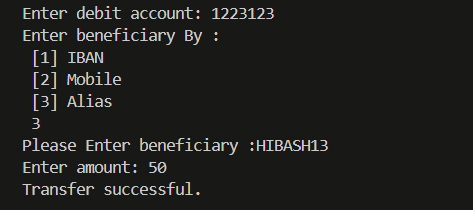

# ProgressSoft Internship Program

- climoneytransfer -> Money Transfer CLI Application (Phase 1)

- main (CliqTransferAPIs) -> Allow users to use REST APIs to perform the CliQ transfers as REST APIs (Phase 2)

# Phase 1 - Money Transfer CLI Application

This is a Command-Line Interface (CLI) application for performing secure money transfers using the CliQ approach. It allows transfers to Mobile Numbers, Aliases, or IBANs, with validation and account management.

The implementation has been implemented by Visual Code and used maven environment

# Run task 
- # Main

- # List of Accounts

- # List of Transfers

- # Transfer Money By :

* # IBAN :

* # Mobile :

* # Alias:

