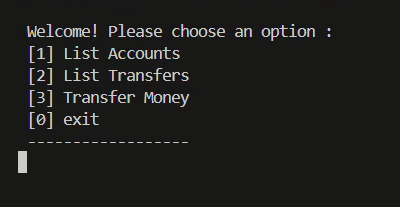
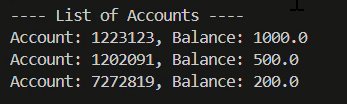

# Money Transfer CLI Application

This is a Command-Line Interface (CLI) application for performing secure money transfers using the CliQ approach. It allows transfers to Mobile Numbers, Aliases, or IBANs, with validation and account management.

The implementation has been implemented by Visual Code and used maven environment

# Project Structure
.
└── climoneytransfer/
    ├── src/
    │   ├── main/
    │   │   └── java/
    │   │       ├── data/
    │   │       │   └── AccountCSVReader.java
    │   │       ├── main/
    │   │       │   └── Main.java
    │   │       ├── modal/
    │   │       │   ├── Account.java
    │   │       │   └── Transfer.java
    │   │       ├── service/
    │   │       │   └── TransferService.java
    │   │       └── util/
    │   │           └── Validator.java
    │   └── accounts.csv
    ├── target/
    │   └── classes/
    │       └── data/
    │           ├── AccountCSVReader.class
    │           ├── main/
    │           │   └── Main.class
    │           ├── modal/
    │           │   ├── Account.class
    │           │   └── Transfer.class
    │           ├── service/
    │           │   └── TransferService.class
    │           └── util/
    │               └── Validator.class
    └── pom.xml

#Run task

- Main Page

- List of Accounts

-List of Transfers

